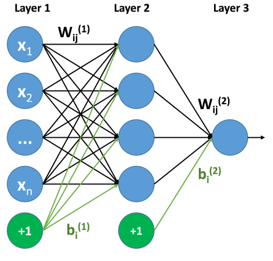
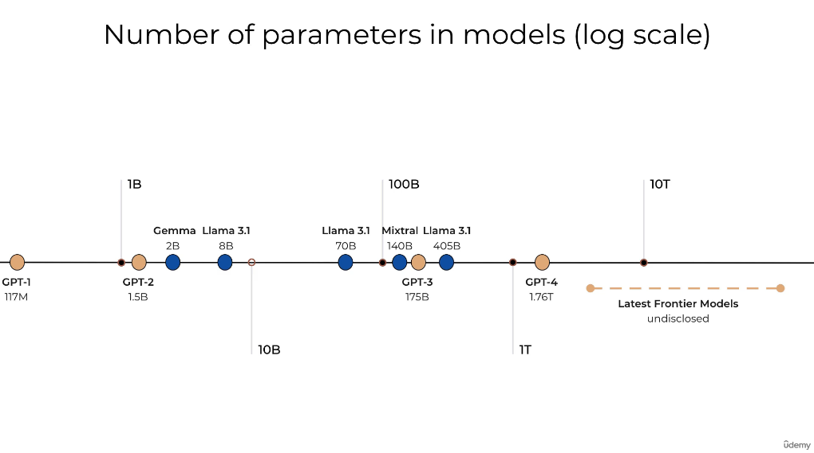
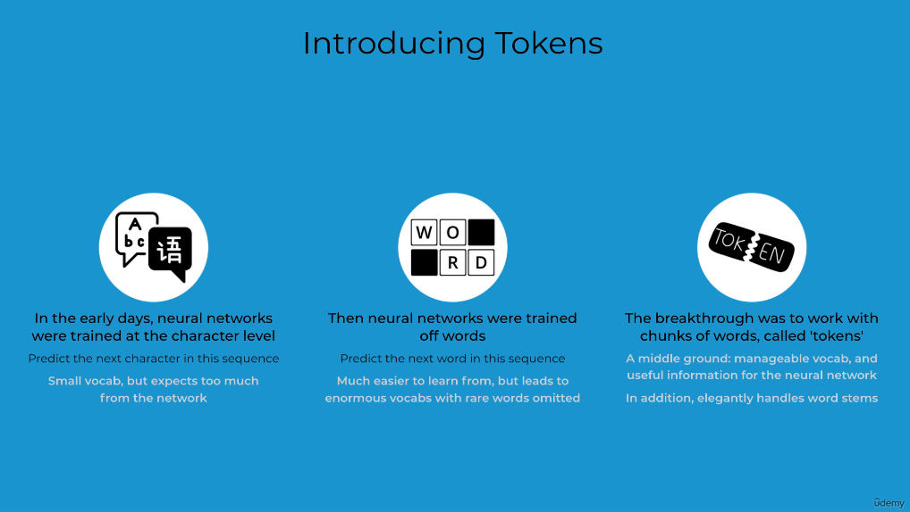
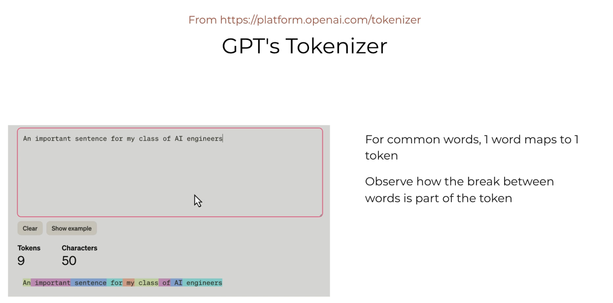
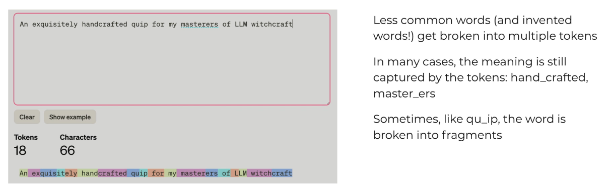
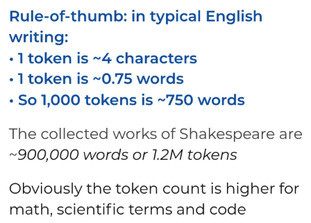

## Parameters

By the numbers of parameters of LLMs we mean the number of variables that the model has. In terms of Neural Networks, the number of parameters is the number of weights and biases in the model. If the LLM is an input-output system $f(\vec{X})$, then the number of parameters is the size of the vector $\vec{X}$.

## Tokenization

Tokenization is the process of converting a string of text into a list of tokens. Tokens are the basic units of meaning in a language model. For example, the sentence "I love pizza" can be tokenized into the following tokens: ["I", "love", "pizza"].

The larger our query, the larger the number of tokens it will be tokenized into. 

The Context Window tells us the total number of tokens that can be examined at a time to predict the next token. Roughly speaking, the context window is the number of tokens that the model can "see" at once. The context window is a fixed size, and it determines how much information the model can use to generate its output. This size is itself limited by the number of parameters of the model and it's architecture. The larger the model, the larger the context window.

Chatbot "memory" is based on making previous interactions part of the models context window for the next interaction. Of course, as the context window is fixed, the model will have to "forget" some of the previous interactions in order to make room for the new ones. The better the method of selecting which interactions to keep, the better memory will the chatbot appear to have.