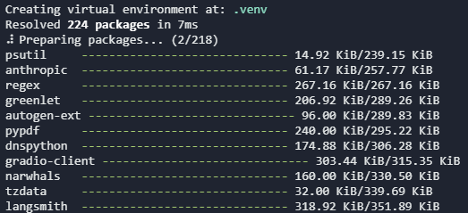
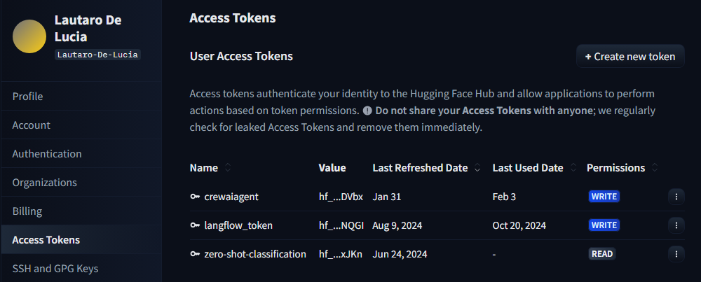
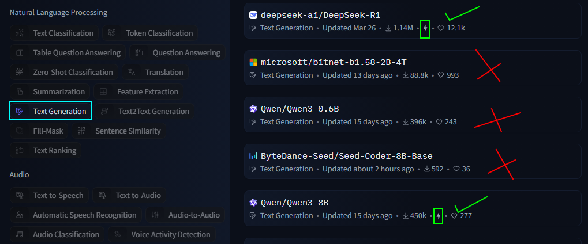
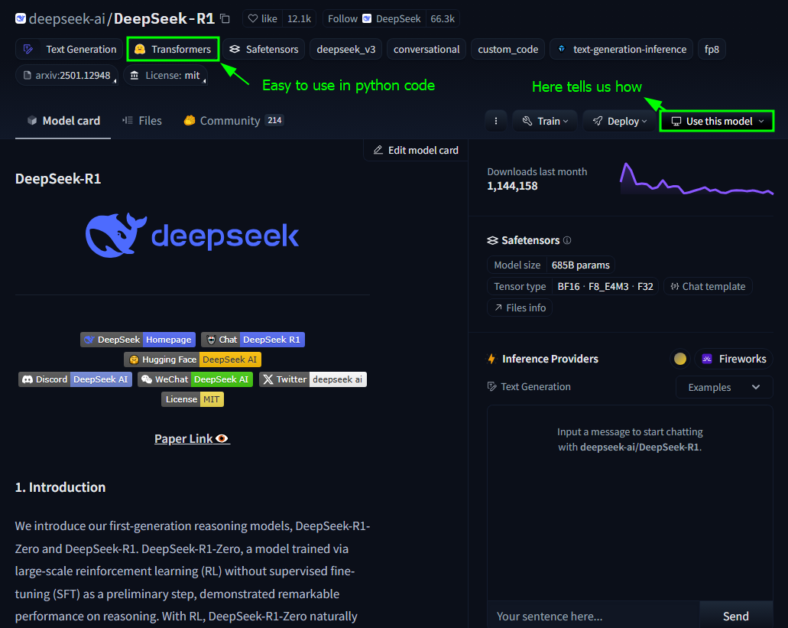
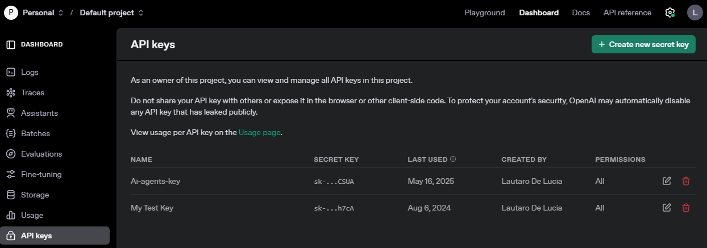
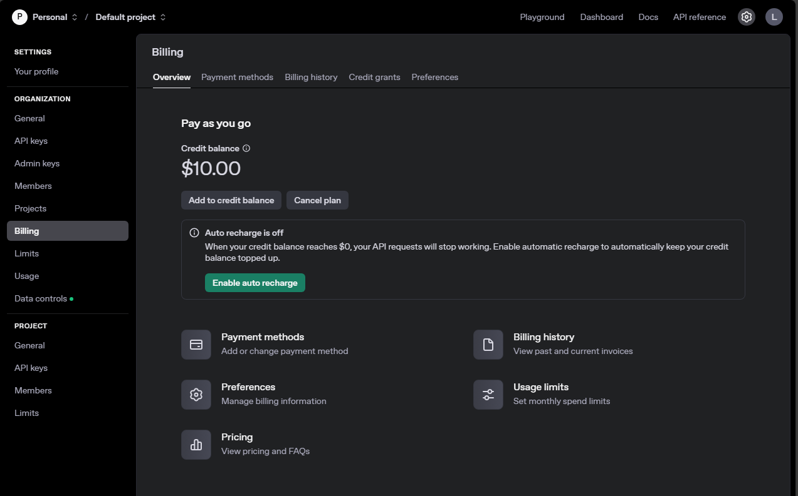

## Environment Setup

#### Windows Setup

Check the live document with full instructions [here](https://github.com/ed-donner/agents/blob/main/setup/SETUP-PC.md)


There are 4 common gotchas to developing on Windows to be aware of:

- ***Permissions***:  Please take a look at this [tutorial](https://chatgpt.com/share/67b0ae58-d1a8-8012-82ca-74762b0408b0) on permissions on Windows. **<font color='green'><span>&#10003;</span></font>**
- ***Anti-virus, Firewall, VPN***: These can interfere with installations and network access; try temporarily disabling them as needed. **<font color='green'><span>&#10003;</span></font>**
- If you've not worked with Data Science packages on your computer before, you'll need to install ***Microsoft Build Tools***. [Here](https://chatgpt.com/share/67b0b762-327c-8012-b809-b4ec3b9e7be0) are instructions. A student also mentioned that [these](https://github.com/bycloudai/InstallVSBuildToolsWindows) instructions might be helpful for people on Windows 11. **<font color='green'><span>&#10003;</span></font>**
- ***The evil Windows 260 character limit to filenames*** - [here](https://chatgpt.com/share/67b0afb9-1b60-8012-a9f7-f968a5a910c7) is a full explanation and fix! You'll need to restart after making the change. **<font color='green'><span>&#10003;</span></font>**


#### Install UV  

- Instructions may be found on the official documentation here [here](https://docs.astral.sh/uv/getting-started/installation/). On windows, open PowerShell as an administrator and type

```powershell

powershell -ExecutionPolicy ByPass -c "irm https://astral.sh/uv/install.ps1 | iex"

```

then type `exit` to exit PowerShell.

- Open the powershell again and type `uv --version` to check it has been properly installed. Navigate to the directory where you want to clone your project and/or place your files and type `code .`. Within VSC, select View >> Terminal, to see a Terminal window. Type `pwd` to see the current directory, and check you are in the 'agents' directory. Type `uv --version` to check you are effectively accessing uv from within VSC. 

- Once placed on the root of the project, start by running `uv self update` to make sure you're on the latest version of uv. Then simply run `uv sync` to install all the dependencies for the project.   



- Finally, run these commands to be ready to use CrewAI in week 3 - please note that this needs you to have installed Microsoft Build Tools.
  - `uv tool install crewai`
  - `uv tool upgrade crewai` 

- Checking that everything is set up nicely
  - Confirm that you now have a folder called '.venv' in your project root directory (agents)
  - If you run uv python list you should see a Python 3.12 version in your list (there might be several)
  - If you run uv tool list you should see crewai as a tool

- With uv, we do a few things differently
  - Instead of `pip install xxx` you do `uv add xxx` - it gets included in your pyproject.toml file and will be automatically installed next time you need it
  - Instead of `python my_script.py` you do `uv run my_script.py` which updates and activates the environment and calls your script
  - You don't actually need to run `uv sync` because uv does this for you whenever you call `uv run`
  - It's better not to edit `pyproject.toml` yourself, and definitely don't edit `uv.lock`. If you want to upgrade all your packages, run `uv lock --upgrade`
  - uv has really terrific docs [here](https://docs.astral.sh/uv/) - well worth a read!

## LLM Provider Setup

- Most LLMs will run in the cloud, meaning we will have to communicate with an LLM provider trough an API Key. All API keys are stored in a `.env` file in the root of the project. 

#### Setting up a Gemini API Key (Free Tier)

- Ideally, we would like to replace the OpenAI API with the Gemini free tier, or on the worst case scenario run models locally trough Ollama.  

- Get your Gemini API Key from [here](https://ai.google.dev/gemini-api/docs), which should take you [here](https://aistudio.google.com/u/1/apikey).

- Once you have the API key, create a .evn file in root and add it as an environment variable `GEMINI_API_KEY=<your_api_key>`.

#### Setting up Ollama (Free - Local)

- Download Ollama from [here](https://ollama.com/download/windows)

- Check the different models at the [library](https://ollama.com/library) and install the one you want with `ollama pull <model_name>`.

- Bear in mind that without a GPU, you will only be able to run lightweight ('tiny' or 'mini') models.

- You won't need an API key for Ollama, since it runs locally.

#### Setting up Huggingface (Free - Limited Usage)

- You'd need to create a huggingface account and get a Huggingface Token (make sure it has write permissions). 



- Copy the token to the .env file at root.

- Search for a good text generation model that has enabled the Inference API (which means it runs on Huggingface's servers and will allow you some free usage).





#### Setting up an OpenAI API Key (Paid - Credits)

- You'd need to create an OpenAI account and get an OpenAI API Key. 



- Then go to Settings >> Billing to buy some credits.




## Basic Prompting of LLMs

Most LLMs we will be working with expect at least two parameters: 
- system prompt: a set of instructions that define the behavior of the model. It includes both things like setting what the model's tone should be as well as adding additional context to the model.
- user prompt: the input that the model will use to generate its output.

```python 
# EXAMPLE: LLM whose task is summarizing the contents of a website

system_prompt = "You are an assistant that analyzes the contents of a website \
and provides a short summary, ignoring text that might be navigation related. \
Respond in markdown."

def generate_websate_user_prompt(website):
    user_prompt = f"You are looking at a website titled {website.title}"
    user_prompt += "\nThe contents of this website is as follows; \
please provide a short summary of this website in markdown. \
If it includes news or announcements, then summarize these too.\n\n"
    user_prompt += website.text
    return user_prompt

```

For OpenAI's API, the system and user prompts are passed as a list of dictionaries, where each dictionary has two keys: "role" and "content". The "role" can be either "system" or "user", and the content is the text of the prompt.

Luckily, the format became so popular that it has been adapted by most major LLM providers. 

(P.D there are other roles that we need not get into here)

```py

messages = [
    {"role": "system", "content": "You are a snarky assistant"},
    {"role": "user", "content": "What is 2 + 2?"}
]

response = openai.chat.completions.create(model="gpt-4o-mini", messages=messages)
print(response.choices[0].message.content)


```

## Transformers 

- There are ways to work with LLMs that offer more granular control over the model's behavior. Here, we would use tools such as Huggingface's Transformers library, Langchain, or LlamaIndex. We will cover this in [1_Transformers](../1_Transformers/). 