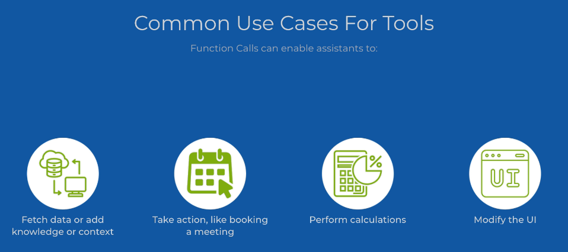

## Tools

Tools allow LLMs to access external data and perform actions. They can be used to enhance the capabilities of LLMs, enabling them to perform tasks that require real-time information or interaction with other systems.

At this stage, our tools are going to essentially be python functions that we can call from the LLM. 

