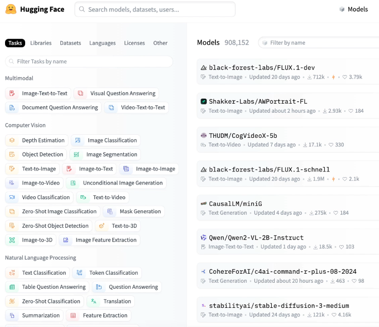
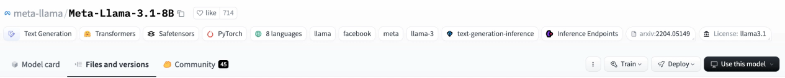
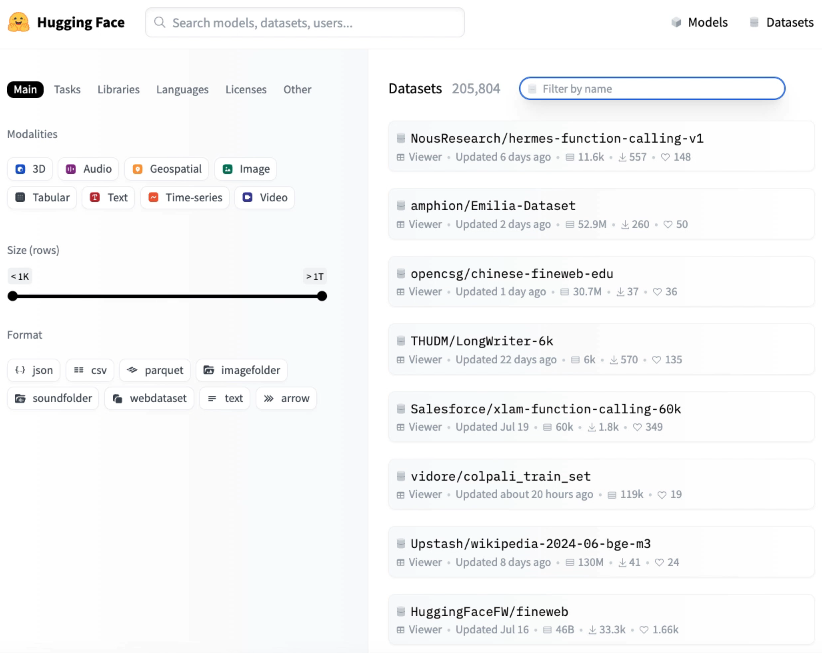

## Huggingface 

Huggingface is a platform that provides a wide range of pre-trained models for all-things ML. It hosts open source models, datasets, and tools for building and deploying machine learning applications. Huggingface is particularly known for its Transformers library, which provides a simple and consistent API for working with transformer models. These models are widely used in natural language processing (NLP) tasks, such as text classification, translation, and summarization. Huggingface also provides a user-friendly interface for fine-tuning and deploying models, making it easy for developers to integrate state-of-the-art NLP capabilities into their applications. The platform has a large and active community, which contributes to the development of new models and tools, making it a go-to resource for machine learning practitioners.

#### Huggingface Libraries

- Huggingface Hub: A platform for sharing and discovering machine learning models and datasets. It allows users to upload, download, and collaborate on models and datasets.
- Huggingface Datasets: A library for easily accessing and sharing datasets for machine learning. It provides a simple API for loading and processing datasets, making it easy to use them in your projects.
- Huggingface Transformers: A library for working with transformer models. It provides a simple and consistent API for loading and using pre-trained models, making it easy to integrate state-of-the-art NLP capabilities into your applications.

Of course, all of these libraries use pytorch or tensorflow under the hood. 

Some other advanced libraries include

- Huggingface peft: A library for parameter-efficient fine-tuning of transformer models. It provides a simple API for fine-tuning models with a small number of parameters, making it easy to use in your projects.
- Huggingface trl: A library for reinforcement learning with transformer models. It provides a simple API for training and evaluating transformer models with reinforcement learning, making it easy to use in your projects.
- Huggingface Accelerate: A library for accelerating the training of transformer models. It provides a simple API for optimizing the training process, making it easy to use in your projects.

## Huggingface Web UI 

#### Models

When we select any of these models, we will be able to see
- The ***model card***, which contains information about the model, such as its architecture, training data, and evaluation metrics. We can also see the model's input and output formats, as well as examples of how to use the model in code. 
- The ***model's files***, which include the model weights, configuration files, and tokenizer files. These files are used to load and use the model in your projects.

#### Datasets

