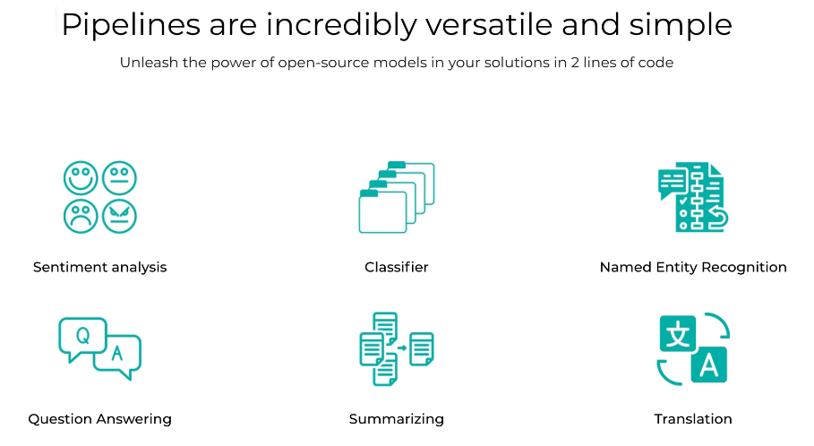
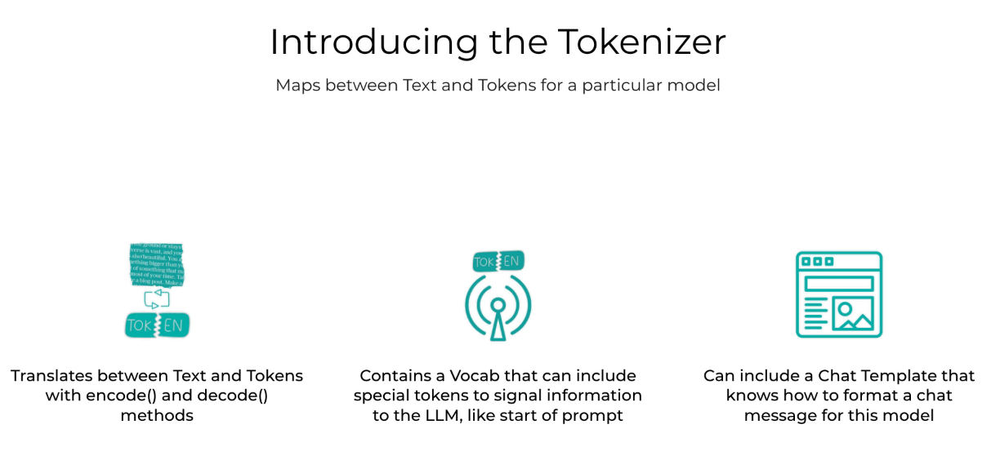
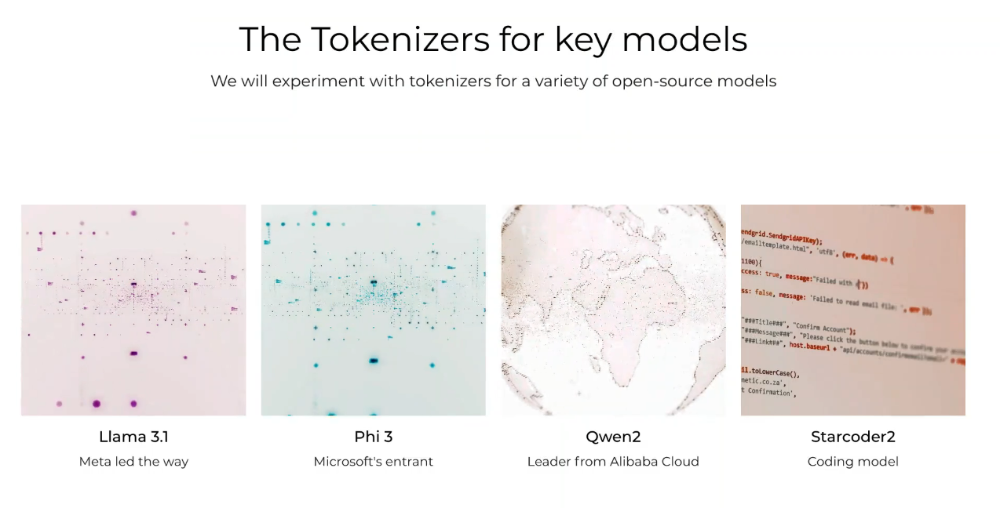
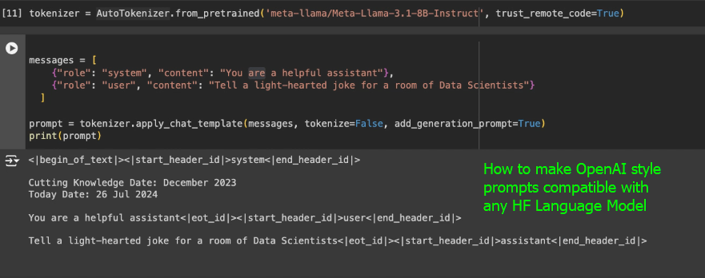

## 

There are two main modes of interacting with huggingface code, that is, two main huggingface APIs: 

- Pipelines: 
  - Pipelines are a high-level API for using pre-trained models in Hugging Face. They provide a simple and consistent interface for performing common tasks such as text classification, translation, and summarization. Pipelines automatically handle the loading of models and tokenizers, making it easy to use pre-trained models without having to write a lot of code.
  - Pipelines are designed to be user-friendly and require minimal setup. They are ideal for quick prototyping and experimentation with pre-trained models.
  - Pipelines are built on top of the Transformers library, which provides the underlying model architecture and training functionality.

<center>



</center>


```py

import torch 
from transformers import pipeline
from diffusers import DiffusionPipeline
from datasets import load_dataset
import soundfile as sf
from IPython.display import Audio


# Example of using a pipeline for sentiment analysis
classifier = pipeline("sentiment-analysis")
result = classifier("I love using Hugging Face!")
print(result)
# Output: [{'label': 'POSITIVE', 'score': 0.9998}]

# Example of using a pipeline for zero-shot classification
classifier = pipeline("zero-shot-classification")
result = classifier("Huggingface's Transformers library is amazing!", candidate_labels=["Technology", "Sports","politics"])
print(result)
# Output: {'sequence': "Huggingface's Transformers library is amazing!", 'labels': ['Technology', 'Sports', 'politics'], 'scores': [0.9998, 0.0001, 0.0001]}

# Example of Image Generation 
image_generator = DiffusionPipeline.from_pretrained("CompVis/stable-diffusion-v1-4",
torch_dtype=torch.float16,
use_safetensors=True,
variant="fp16",
).to("cuda")

text = "A fantasy landscape with mountains and a river"
image = image_generator(text, num_inference_steps=50, guidance_scale=7.5).images[0]
image.show()
```

- Tokenizers:
  - Tokenizers are a lower-level API for working with text data in Hugging Face. They provide a more flexible and customizable way to preprocess text data for use with pre-trained models. Tokenizers handle tasks such as tokenization, encoding, and decoding of text data, allowing users to create custom preprocessing pipelines for their specific use cases.
  - Tokenizers are designed for users who need more control over the preprocessing of their text data and want to create custom tokenization strategies.
  - Tokenizers are also built on top of the Transformers library, but they provide a more granular level of control over the preprocessing steps.



Of course, tokenizers are specific to each model, since each neural network has a specific format for it's inputs (embeddings).



```py

tokenizer = AutoTokenizer.from_pretrained("meta-llama/Meta-Llama-3.1-8B", trust_remote_code=True)

text = "Hello, how are you?"
tokens = toenizer.encode(text)
tokens

# Output: [123, 456, 789, 1011, 1213, 1415, ...]

```




## Hugginface's Model Class

#### Model Parameters


- ***Quantization***: Reducing the precision of the model weights to save memory and improve inference speed. This is especially useful for deploying models on edge devices or in production environments where resources are limited.
- ***Model Internals***: Modifying internal structure of the model, such as the number of layers, attention heads, and hidden dimensions, can help in optimizing the model for specific tasks or hardware.
- ***Streaming***: Streaming allows for processing large inputs or outputs in smaller chunks, which can be useful for tasks like text generation or image processing where the input or output size may be large.


#### Example

```py

