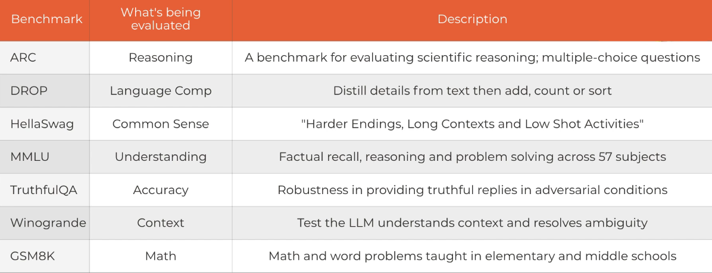
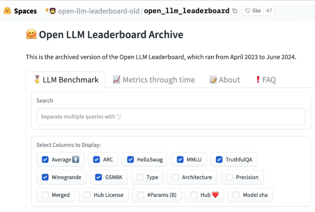
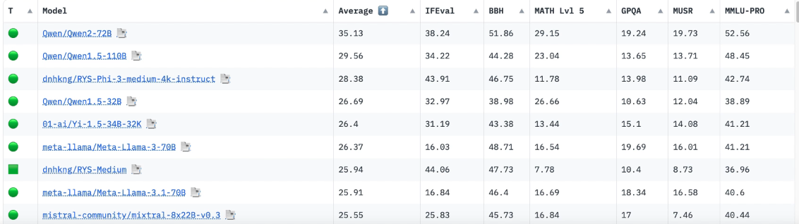

## Common Benchmarks  

## Huggingface Leaderboards

HuggingFace openLLM leaderboard is a great resource to compare the performance of different LLMs. It provides a comprehensive overview of various models, their architectures, and their performance on different benchmarks.

