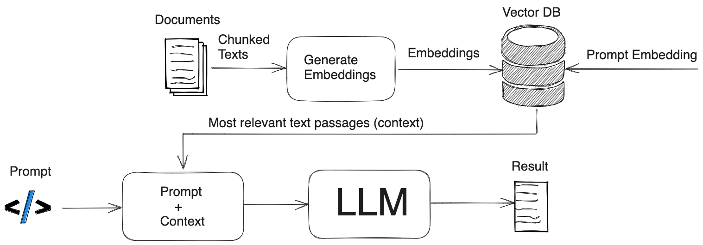
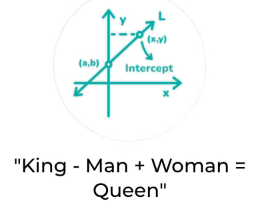
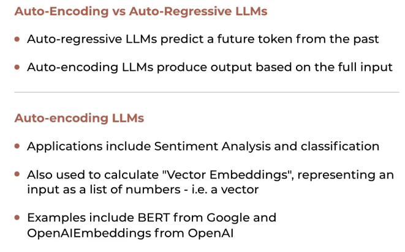
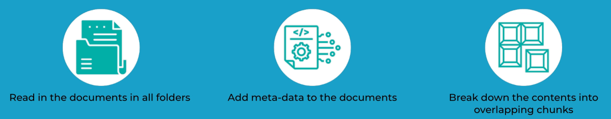
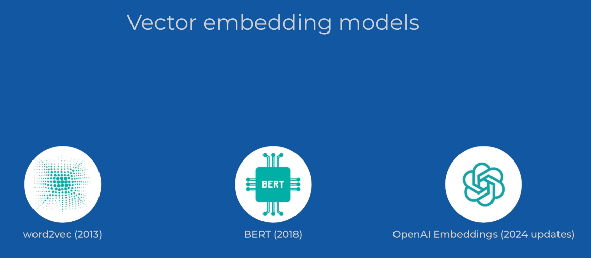
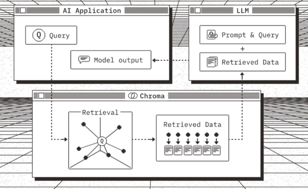

## Introduction to RAG

RAG (Retrieval-Augmented Generation) is a technique that is based on building a "knowledge-base" of expert knowledge related to the chatbot's functionality and then ensuring that the chatbot can access this knowledge when generating responses. 

Among other things, this allows us to generate responses that are more accurate and relevant to the user's query with relatively lightweight models, since now the model does not need to know everything about the world, but only needs to know how to use the knowledge base to find the information it needs and produce a coherent summary of it. 

RAG is fundamentally based on the idea of combining two different components: a retriever and a generator. The retriever is responsible for finding relevant documents from a large corpus of text, while the generator is responsible for generating a response based on the retrieved documents.

The generator is usually a single LLM, whereas the retriever is based on a vector database. A vector database is a type of database that stores data in the form of vector embeddings, which are numerical representations of text data. These embeddings are generated using a machine learning model, such as a transformer-based model, and are used to represent the semantic meaning of the text. Thus, when we want to retrieve documents that are relevant to the user's query, we can convert the query into a vector embedding and then search for the most similar embeddings in the vector database. This similarity search is literally a mathematical operation of similarity between two vectors. The way NLP works is by converting text into vectors, and then performing mathematical operations on these vectors to emulate human reasoning as it is conveyed trough language. 

## Auto-Regressive LLMs vs Auto-Encoding LLMs

## Langchain

Langchain is a framework for developing applications powered by language models. It provides a standard interface for working with LLMs, as well as a set of tools and components that make it easy to build complex applications. Essentially, it's supposed to make it easy to "chain" together LLMs, hence it's name. 

## Vector Stores

