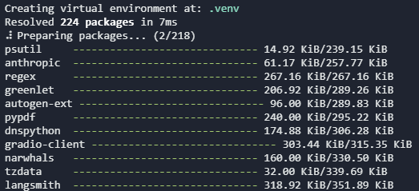
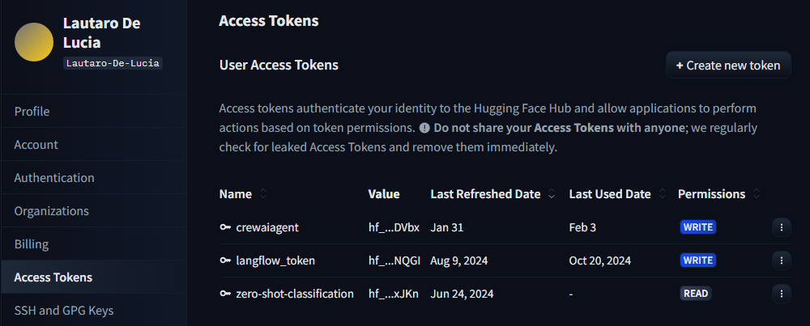
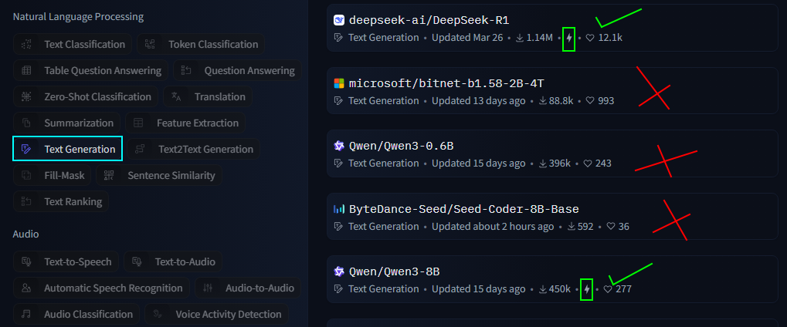

https://github.com/ed-donner/agents/


## Environment Setup

Setting up an environment for AI development can be tricky, which is why we will be aided by two important tools: 

- **Cursor IDE**: A fork of VSC that is designed for AI development ([download](https://www.cursor.com/)).
- **UV**: A package manager, such as pip or anaconda, but tailored for AI development.

#### Windows Setup

Check the live document with full instructions [here](https://github.com/ed-donner/agents/blob/main/setup/SETUP-PC.md)


There are 4 common gotchas to developing on Windows to be aware of:

- ***Permissions***:  Please take a look at this [tutorial](https://chatgpt.com/share/67b0ae58-d1a8-8012-82ca-74762b0408b0) on permissions on Windows. **<font color='green'><span>&#10003;</span></font>**
- ***Anti-virus, Firewall, VPN***: These can interfere with installations and network access; try temporarily disabling them as needed. **<font color='green'><span>&#10003;</span></font>**
- If you've not worked with Data Science packages on your computer before, you'll need to install ***Microsoft Build Tools***. [Here](https://chatgpt.com/share/67b0b762-327c-8012-b809-b4ec3b9e7be0) are instructions. A student also mentioned that [these](https://github.com/bycloudai/InstallVSBuildToolsWindows) instructions might be helpful for people on Windows 11.
- ***The evil Windows 260 character limit to filenames*** - [here](https://chatgpt.com/share/67b0afb9-1b60-8012-a9f7-f968a5a910c7) is a full explanation and fix! You'll need to restart after making the change.


#### Materials Setup

- git clone https://github.com/ed-donner/agents.git

This creates a new directory agents within your Projects folder and downloads the code for the class. Do `cd agents` to go into it. This is the project root directory.


#### Install Cursor IDE (Optional)

#### Install UV  

- Instructions may be found on the official documentation here [here](https://docs.astral.sh/uv/getting-started/installation/). On windows, open PowerShell as an administrator and type

```powershell

powershell -ExecutionPolicy ByPass -c "irm https://astral.sh/uv/install.ps1 | iex"

```

then type `exit` to exit PowerShell.

- Open the powershell again and type `uv --version` to check it has been properly installed. Navigate to the directory where you want to clone your project and/or place your files and type `code .`. Within VSC, select View >> Terminal, to see a Terminal window. Type `pwd` to see the current directory, and check you are in the 'agents' directory. Type `uv --version` to check you are effectively accessing uv from within VSC. 

- Once placed on the root of the project, start by running `uv self update` to make sure you're on the latest version of uv. Then simply run `uv sync` to install all the dependencies for the project.   



- Finally, run these commands to be ready to use CrewAI in week 3 - please note that this needs you to have installed Microsoft Build Tools.
  - `uv tool install crewai`
  - `uv tool upgrade crewai` 

- Checking that everything is set up nicely
  - Confirm that you now have a folder called '.venv' in your project root directory (agents)
  - If you run uv python list you should see a Python 3.12 version in your list (there might be several)
  - If you run uv tool list you should see crewai as a tool

- With uv, we do a few things differently
  - Instead of `pip install xxx` you do `uv add xxx` - it gets included in your pyproject.toml file and will be automatically installed next time you need it
  - Instead of `python my_script.py` you do `uv run my_script.py` which updates and activates the environment and calls your script
  - You don't actually need to run `uv sync` because uv does this for you whenever you call `uv run`
  - It's better not to edit `pyproject.toml` yourself, and definitely don't edit `uv.lock`. If you want to upgrade all your packages, run `uv lock --upgrade`
  - uv has really terrific docs [here](https://docs.astral.sh/uv/) - well worth a read!


#### Setting up a Gemini API Key  

- Ideally, we would like to replace the OpenAI API with the Gemini free tier, or on the worst case scenario run models locally trough Ollama.  

- Get your Gemini API Key from [here](https://ai.google.dev/gemini-api/docs), which should take you [here](https://aistudio.google.com/u/1/apikey).

- Once you have the API key, create a .evn file in root. 

#### Setting up with Ollama

- Check the official [guides](https://github.com/ed-donner/agents/tree/main/guides) 

- Download Ollama from [here](https://ollama.com/download/windows)

- Check the different models at the [library](https://ollama.com/library) and install the one you want with `ollama pull <model_name>`.

- Bear in mind that without a GPU, you will only be able to run lightweight ('tiny' or 'mini') models.

#### Setting up with Huggingface

- You'd need to create a huggingface account and get a Huggingface Token (make sure it has write permissions). 



- Copy the token to the .env file at root.

- Search for a good text generation model that has enabled the Inference API (which means it runs on Huggingface's servers and will allow you some free usage).




#### Setting up with OpenAI API Key
