## Introduction to AI Agents

An **AI Agent** is essentially LLM + code. More generally, an AI Agent is any program where LLM outputs control the workflow, as opposed to the programmer using an LLM to generate code. The mechanism trough which our LLMs control the workflow is called a "tool". A tool is any program that can be called by an LLM. 

In their famous [document](https://www.anthropic.com/engineering/building-effective-agents) "Building Effective Agents", anthropic distinguishes two types of so-called "Agentic Systems":

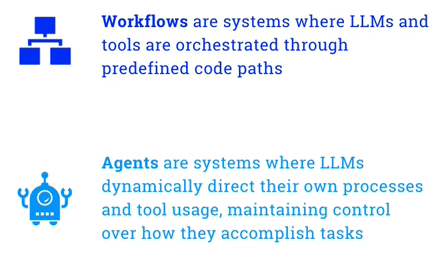

## Workflow Design Patterns

#### Prompt Chaining

Prompt chaining is a design pattern where the output of one prompt is used as the input for another. This allows for more complex interactions and can help to refine the output of the LLM. In the middle, we may add our own code as middleware to process the output of the LLM before passing it to the next LLM.

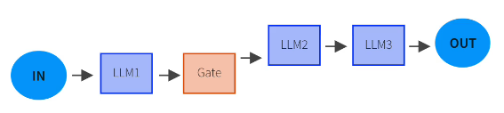

***Scenario***: A customer support agent uses a multi-step reasoning process to classify a ticket, determine its urgency, and generate a suitable response. Each step is handled by a different prompt that feeds into the next.

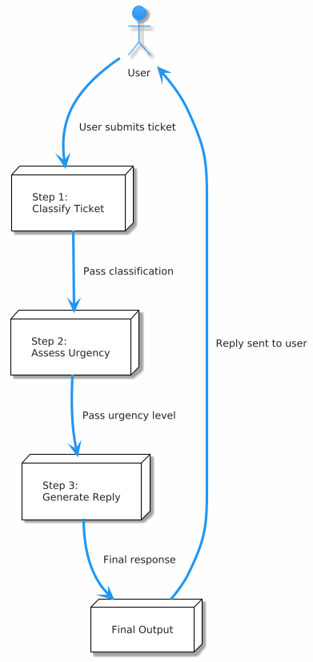

#### Routing 

Routing is a design pattern where an initial LLM decides which of several other LLMs to call based on the input (*routes* this input). It incentivizes proper modularization of the LLMs, as each LLM can be specialized for a specific task (e.g. one LLM for math, another for writing, etc.). 

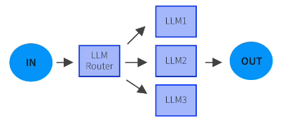

***Scenario***: A helpdesk assistant routes user queries to specialized LLMs depending on their category: billing, technical support, or general inquiries.

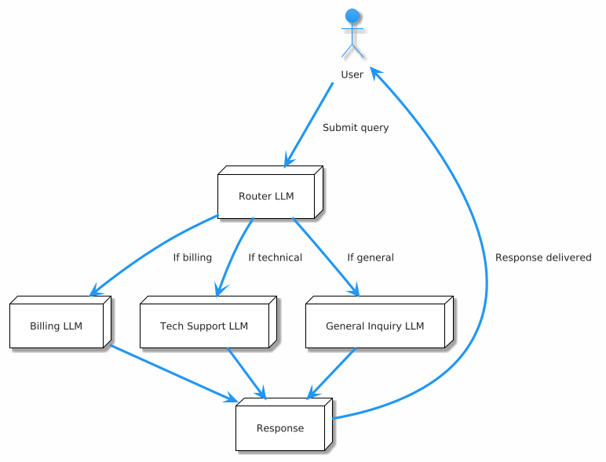

#### Parallelization 

Send the same input to multiple LLMs and combine the outputs. This can be useful for tasks that require multiple perspectives or when the output of one LLM is not sufficient (e.g. if it's a True or False question that can be tackled from multiple perspectives, represented by 5 LLMs, then make the output True or False based on a majority rule).

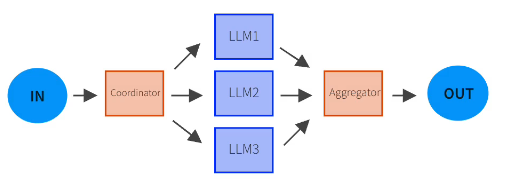

***Scenario***: A product review summarizer sends the same product reviews to multiple LLMs trained with different summarization styles (formal, informal, bullet points) and combines their outputs into a rich final summary.

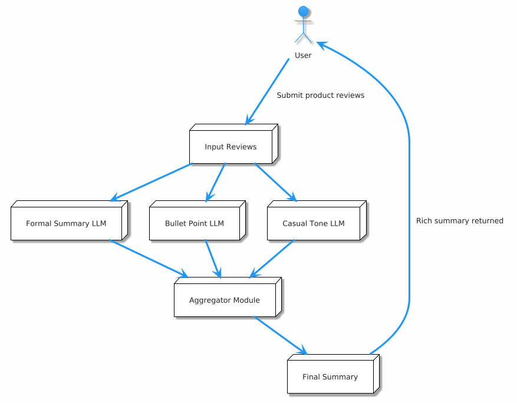

#### Orchestrator-Worker

Have an orchestrator LLM that breaks down a task into smaller subtasks and assigns them to worker LLMs. This is similar to the routing pattern, but instead of making a "pass" of the task, the task is broken down by the orchestrator LLM. 

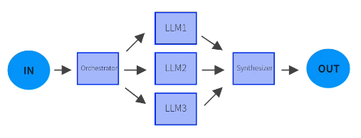

***Scenario***: A report generator receives a topic and uses an orchestrator LLM to divide the task into sections (Introduction, Data Analysis, Conclusion). Each section is handled by a different worker LLM.

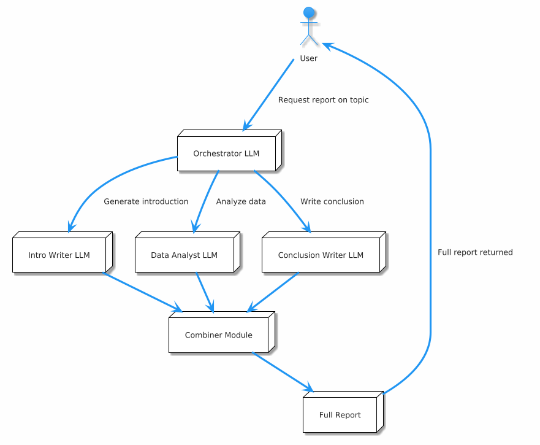

#### Evaluator-Optimizer

Have an evaluator LLM that evaluates the output of a worker LLM and provides feedback. The evaluator LLM is used to optimize the output of the worker LLM by providing suggestions for improvement.

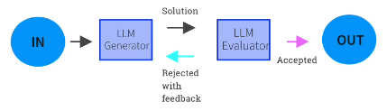

***Scenario***: A grant proposal writing agent generates an initial draft of a proposal. An evaluator LLM reviews the draft, identifies weaknesses, and gives structured feedback. The generator then revises the draft based on this feedback. This loop continues until the evaluator is satisfied (e.g., based on a confidence score or human-defined stop condition).

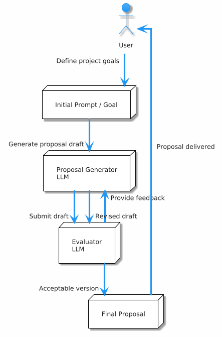

## Agent Design Patterns 

Agentic design patterns are about defining a proper mechanism of interaction between the agent and the environment. The workflow is continuous bar from a stop condition.

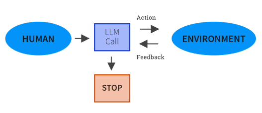

This flexibility allows us to tackle more complex tasks, but also introduces more challenges, such as making the program more susceptuible to errors due to the inherent randomness of LLMs. 

