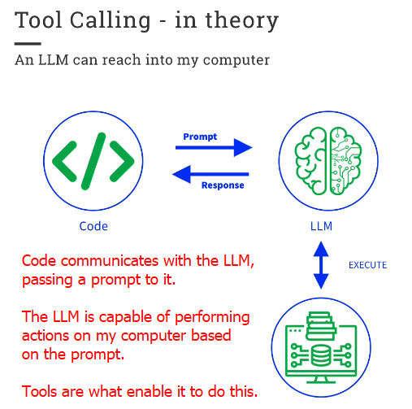
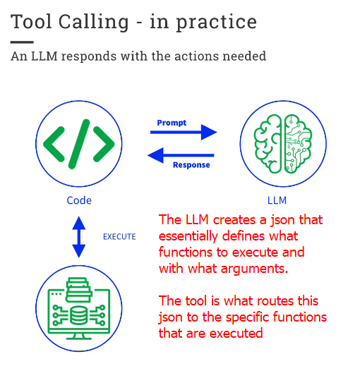
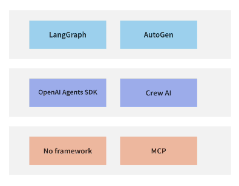

## Resources & Tools

Resources is the mechanism trough which we provide our LLMs with context. It essentially means ensuring the data the LLM is working with is relevant to the task at hand. This can be done by providing the LLM with a set of documents, a database, feedback, or any other source of information that can be used to inform the LLM's output (each of these would be a **resource** providaded to the LLM).

Tools are the mechanisms through which we provide our LLMs with the ability to perform actions. The greater the ability of the LLM to perform actions, the larger it's degree of autonomy from the programmer. 

As we will se when we get to code these agents, however, the actual mechanism is far more pedestrian and deterministic, as it needs to be for the system to be reliable. 

## Agentic Frameworks 

Agentic Frameworks are, like any framework when it comes to coding, a set of abstractions designed to help us build complex systems. We can organize these frameworks according to their degree of abstraction. Starting from coding agents directly and implementing some protocols such as MCP, moving up to basic SDKs, and finally to high-level abstractions such as the ones provided by LangGraph and AutoGen. 

To clarify, this is a classification in terms of abstraction, not complexity. It is likely harder to learn LangGraph than it is to learn how to code our own agents. But LangGraph allows for the creation of more complex systems that we could hardly create by coding agents directly.

