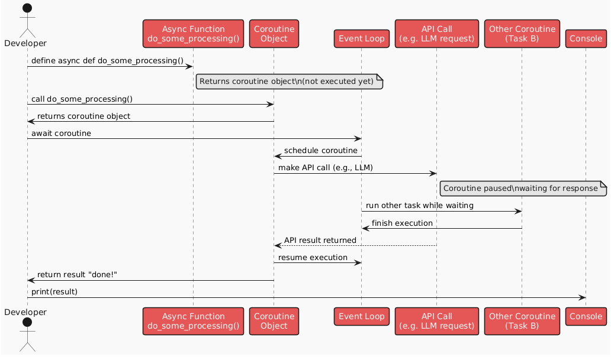

## Asyncio Introduction

All Agent frameworks use asynchronous python (asyncio) to run the agents. 

It's essentially the python equivalent of JavaScript's async/await. It allows us to run multiple tasks concurrently without blocking the main thread. 

```py

import asyncio

# Example of async function
async def do_some_processin(): -> str:
    # Simulate some processing
    return "done!"  

result await do_some_processing()
print(result)  # Output: done!  

```

The reason agent frameworks use asyncio so much is that an agent will need to call multiple APIs for LLMs, tools, and other agents.

Functions defined with async def are called coroutines. They can be paused and resumed, allowing other tasks to run in the meantime.

When you call a coroutine, it doesn't run immediately. Instead, it returns a coroutine object. To actually run the coroutine, we need to await it, which schedules it for execution within an event loop. 

There is a single event loop that runs in the background, managing all the coroutines. So e.g if a coroutine stops at some point because it is waiting for an API call to finish, the event loop can run other coroutines in the meantime. 

<center>



</center>

The asyncio library provides a way to run multiple coroutines concurrently, allowing us to take advantage of the asynchronous nature of Python.

```py

# And now let's do it in parallel
# It's important to recognize that this is not "multi-threading" in the way that you may be used to
# The asyncio library is running on a single thread, but it's using a loop to switch between tasks while one is waiting

async def do_a_lot_of_work_in_parallel():
    await asyncio.gather(do_some_work(), do_some_work(), do_some_work())

await do_a_lot_of_work_in_parallel()

```

Bar from this brief introduction, it's important that we read the full [guide](./11_async_python.ipynb). It is not recommended we proceed as AI Engineers without a full understanding of asyncio. 