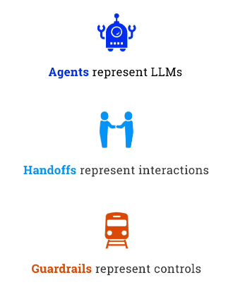
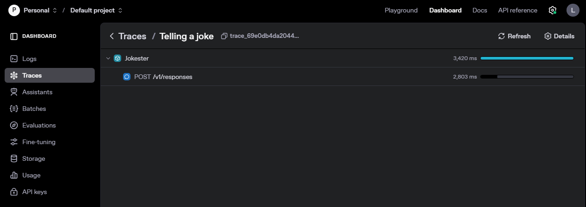

## Introduction to OpenAI Agents SDK

Remember that an SDK is a Software Development Kit. It is a set of tools and libraries that allow developers to build applications using a specific platform or service. In this case, the OpenAI SDK provides tools and libraries for building applications that use OpenAI's language models and other AI capabilities.


## Minimal Terminology

- ***Agents*** represent LLMs (they are wrappers around LLMs). 

- ***Handoffs*** are the process of passing control from one agent to another.

- ***Guardrails*** are the rules that govern the behavior of agents. They are used to ensure that agents behave in a safe and predictable manner.

<center>



</center>

## Minimal Code Example 

#### Creating an instance of an Agent 

Creatng an Agent is done trough instantiating the `Agent` class. The basic parameters are:
- `name`: The name of the agent. This is used to identify the agent in the system.
- `instructions`: The instructions that the agent will follow. This is used to define the behavior of the agent.
- `model`: The model that the agent will use. 
- `tools`: The tools that the agent will use.  

```py

# Agents is an OpenAI package that provides a framework for building and running agents
from agents import Agent, Runner, trace

agent = Agent(name="Jokester", instructions="You are a joke teller", model="gpt-4o-mini")

```

#### Track the Agent 

The `trace` function is used to track the agent's progress. It takes a string as an argument, which is used to identify the trace. The trace will be printed to the console.

When you run an agent, you do it trough an agent runner. The runner takes the agent and the prompt as arguments. The prompt is the input that the agent will use to generate its output.

The runner will actually return a coroutine, so that it must be awaited. 

Finally, we wrap the call to the runner in a `trace` function. This will allow us to track the progress of the agent. When we use tracers, we essentially record the agents conversations and the decisions they make, which we will then be able to manage trough MLOps monitoring tools.


If we go to platform.openai.com/traces, we can see the traces of our agents. 

```py

# Run the joke with Runner.run(agent, prompt) then print final_output

with trace("Telling a joke"):
    result = await Runner.run(agent, "Tell a joke about Autonomous AI Agents")
    print(result.final_output)

```


<center>



</center>

Bar from this introduction, it is highly recommended to check the official [OpenAI SDK documentation](https://openai.github.io/openai-agents-python/), as it is excellently written. 
